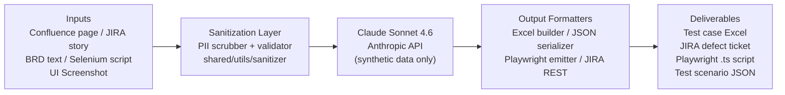
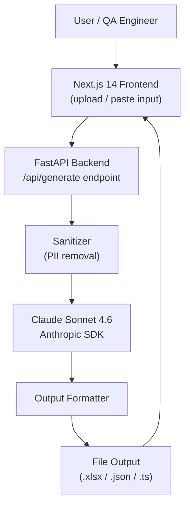

# ARCHITECTURE — QA-Forge (High Level)

## Overview

QA-Forge is a suite of 4 AI-augmented PoC tools sharing a common architecture pattern: raw QA inputs (text, files, screenshots) are sanitized to remove any PII, enriched by Claude Sonnet 4.6, and transformed into structured QA deliverables. Each PoC is independently deployable with its own FastAPI backend and Next.js frontend. Shared utilities (sanitizer, logger, config) live in `shared/utils/`.

---

## High-Level Data Flow

> **TODO (Gopi):** Replace with finalized diagram once shared utilities are designed on Day 2.

---

## Shared Components

| Component | Description | Location |
|-----------|-------------|----------|
| Prompt Library | Versioned master prompts per PoC | `shared/prompts/` + `docs/prompts/` |
| Sanitizer | Strips PII / sensitive patterns before any API call | `shared/utils/sanitizer` |
| Logger | Structured logging (request, response, errors) across all PoCs | `shared/utils/logger` |
| Error Handler | Common Anthropic API error codes + retry with backoff | `shared/utils/error_handler` |
| Config | Env vars, model selection, API keys (via `.env`), output paths | `shared/utils/config` |

---

## Per-PoC Architecture Overview

| PoC | Frontend | Backend | AI Engine | Primary Output |
|-----|----------|---------|-----------|----------------|
| poc-01-testcase-gen | Next.js 14 + Tailwind | Python 3.11 + FastAPI | Claude Sonnet 4.6 (text) | Excel (.xlsx) |
| poc-02-defect-creator | Next.js 14 + Tailwind | Python 3.11 + FastAPI | Claude Sonnet 4.6 (text) | JIRA ticket via REST API |
| poc-03-selenium-to-playwright | CLI / minimal UI | Python 3.11 + FastAPI | Claude Sonnet 4.6 (code) | Playwright .ts script |
| poc-04-ui-vision | Next.js 14 + Tailwind | Python 3.11 + FastAPI | Claude Sonnet 4.6 (vision) | JSON test scenarios |

---

## PoC-Level Architecture (Generic Pattern)

---

## Deployment Model (PoC Phase)

All PoCs run **locally** on the developer machine during the PoC sprint. No cloud infrastructure is required.

> **TODO (Gopi):** Production architecture requires routing through an InfoSec-approved API gateway (e.g., AWS Bedrock Claude deployment or Anthropic Enterprise). Document the production migration path before the pitch. See [SECURITY.md](./SECURITY.md) and [DECISIONS.md](./DECISIONS.md) ADR-004 (to be written).

---

## Technology Versions

| Technology | Version | Notes |
|------------|---------|-------|
| Python | 3.11.x | Minimum required |
| FastAPI | 0.111+ | Async support required |
| Next.js | 14.x | App Router |
| TypeScript | 5.x | Strict mode |
| Tailwind CSS | 3.x | |
| Anthropic SDK (Python) | 0.28+ | `anthropic` package |
| Node.js | 20.x LTS | For Next.js |
