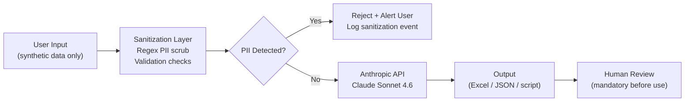

# SECURITY — TestPilot Compliance & Data Handling

> **CRITICAL:** This document governs all data handling decisions across all 4 PoCs. Every team member must read and acknowledge this before using any PoC tool.

---

## 1. Data Classification

| Class | Label | Banking Examples | Handling in TestPilot |
|-------|-------|-----------------|----------------------|
| Public | PUBLIC | Published product brochures, public API docs | May be used as-is |
| Internal | INTERNAL | Internal process docs, generic test templates | May be used after review |
| Confidential | CONFIDENTIAL | Customer account data, transaction history, PAN, Aadhaar, KYC records | **NEVER** use — replace with synthetic equivalents |
| Restricted | RESTRICTED | Production credentials, API keys, encryption keys, HSM material | **NEVER** use — store in `.env` only, never commit |

---

## 2. Data Flow

---

## 3. What IS Sent to Claude API

- Synthetic user story text (no real names, no real accounts)
- Synthetic BRD/Confluence page content (fabricated banking scenarios)
- Synthetic JIRA story descriptions with placeholder data
- Sanitized Selenium scripts (no real URLs, no credentials)
- Synthetic UI screenshots (mockups only, no production screens)
- Structural prompts and formatting instructions

---

## 4. What Is NEVER Sent to Claude API

- Real customer account numbers (Indian banks: 9–18 digit format)
- Real customer names or contact details
- PAN card numbers (`ABCDE1234F` format)
- Aadhaar numbers (12-digit)
- Real JIRA tickets containing customer PII or incident data
- Real Confluence pages with internal Finastra architecture or client data
- Production source code containing secrets, connection strings, or credentials
- API keys, passwords, tokens, or certificates
- Real transaction IDs or reference numbers
- SWIFT codes linked to real transactions
- Employee IDs or HR data

---

## 5. Sanitization Rules

The `shared/utils/sanitizer` module enforces these patterns **before** any Claude API call:

| Pattern | Regex | Action |
|---------|-------|--------|
| Indian bank account number | `\b\d{9,18}\b` | Replace with `[ACCT-REDACTED]` |
| PAN card | `[A-Z]{5}[0-9]{4}[A-Z]{1}` | Replace with `[PAN-REDACTED]` |
| Aadhaar number | `\b\d{4}[\s\-]?\d{4}[\s\-]?\d{4}\b` | Replace with `[AADHAAR-REDACTED]` |
| Email address | `[a-zA-Z0-9._%+\-]+@[a-zA-Z0-9.\-]+\.[a-zA-Z]{2,}` | Replace with `[EMAIL-REDACTED]` |
| Indian mobile number | `(\+91[\s\-]?)?[6-9]\d{9}` | Replace with `[PHONE-REDACTED]` |
| Credit / debit card | `\b(?:\d[ \-]?){13,16}\b` | Replace with `[CARD-REDACTED]` |
| IFSC code | `[A-Z]{4}0[A-Z0-9]{6}` | Flag for manual review |

> **TODO (Gopi):** Review and harden these regexes with the InfoSec team. Add patterns for SWIFT BIC codes, IBAN, and Finastra-specific internal identifiers before any production use.

---

## 6. API Provider Details

| Item | Detail |
|------|--------|
| Provider | Anthropic (claude.ai / api.anthropic.com) |
| Model | Claude Sonnet 4.6 |
| SDK | `anthropic` Python SDK |
| API Endpoint | `https://api.anthropic.com` |

> **TODO (Gopi):** Verify the following from [docs.anthropic.com](https://docs.anthropic.com):
> - Confirm API endpoint and whether an EU region endpoint is available / required for Finastra
> - Confirm Anthropic's data retention policy for API calls (do they store prompts/responses? For how long?)
> - Confirm whether Anthropic's commercial API terms permit banking-domain usage
> - Document findings in this section before the pitch

---

## 7. Retention Policy

> **TODO (Gopi):** Define and document:
> - How long are PoC outputs (Excel files, JSON) retained locally?
> - Where are outputs stored? (local machine only for PoC)
> - What is the deletion procedure after the PoC sprint ends?
> - For production: what is the approved data retention period per Finastra policy?

---

## 8. Approval Status

| Item | Status | Notes |
|------|--------|-------|
| InfoSec approval for external API usage | 🔴 Pending | Required before production rollout |
| Claude account type for PoC | Personal Claude Pro | Gopi's personal account — PoC only |
| Production API gateway | 🔴 Not designed | Must route through Bedrock or approved gateway |
| Finastra legal review | 🔴 Pending | Required before sharing outputs externally |

> **TODO (Gopi):** Initiate InfoSec review conversation ASAP — even informally. Frame as "I'm prototyping a productivity tool using a personal AI subscription; what's the approval path for a team tool?" Document the response here.

---

## 9. Incident Response

> **TODO (Gopi):** Define escalation path for the following scenarios:
> - Suspected PII leak via API call (who to notify? how quickly?)
> - API key compromise (rotation procedure?)
> - Unauthorized access to PoC outputs
> - Discovery that real data was accidentally used in a prompt
>
> Suggested contacts to identify: Direct manager, InfoSec team lead, Data Protection Officer (DPO) if applicable under DPDP Act 2023 (India).

---

## 10. Developer Checklist

Before running any PoC, verify:

- [ ] Input data is 100% synthetic — no real customer, transaction, or employee data
- [ ] `.env` file is present and **not** committed to git (verify `.gitignore`)
- [ ] Sanitizer module is active and tested
- [ ] No screenshots of real Finastra production screens used in poc-04
- [ ] All outputs labeled "AI-GENERATED — REQUIRES HUMAN REVIEW" before sharing
