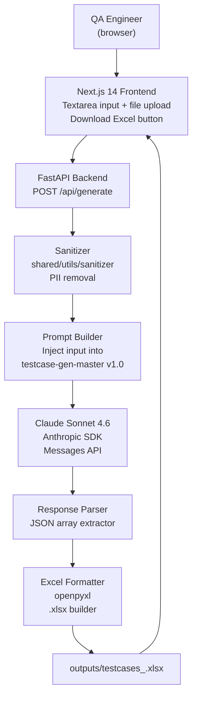

# ARCHITECTURE — PoC 01: Test Case Generator

---

## Component Diagram



> **TODO (Gopi):** Refine diagram on Day 2 once actual file structure is decided.

---

## Components

| Component | File (planned) | Responsibility |
|-----------|---------------|----------------|
| FastAPI app | `backend/main.py` | Route definitions, CORS config |
| Generate endpoint | `backend/routers/generate.py` | `POST /api/generate` handler |
| Sanitizer | `shared/utils/sanitizer.py` | PII regex scrubbing before API call |
| Prompt builder | `backend/services/prompt_builder.py` | Constructs final prompt from template + input |
| Claude client | `backend/services/claude_client.py` | Anthropic SDK wrapper, error handling, retry |
| Response parser | `backend/services/response_parser.py` | Extracts JSON from Claude response |
| Excel formatter | `backend/services/excel_formatter.py` | Converts parsed JSON to .xlsx using openpyxl |
| Config | `backend/config.py` | Env vars, model name, output path |
| Frontend | `frontend/src/app/page.tsx` | Main UI — input textarea, generate button, download |

---

## Data Flow

1. User pastes Confluence/JIRA/BRD/freetext input into frontend textarea
2. Frontend `POST /api/generate` with `{input_type, content}`
3. Backend sanitizes input (PII scrub)
4. Prompt builder constructs full prompt using testcase-gen-master v1.0
5. Claude Sonnet 4.6 returns JSON array of test cases
6. Response parser extracts and validates JSON
7. Excel formatter writes `.xlsx` to `outputs/`
8. Backend returns file path; frontend triggers download

---

## Error Handling

> **TODO (Gopi):** Define error handling strategy on Day 3.

| Error | Handling |
|-------|---------|
| Anthropic API timeout | Retry 2x with exponential backoff; return 503 |
| Claude returns malformed JSON | Log raw response; return 422 with raw text for manual extraction |
| Input too vague (Claude signals error) | Return 400 with Claude's error detail to user |
| PII detected in input | Reject with 400; display sanitization warning to user |

---

## Configuration

> **TODO (Gopi):** Populate `.env.example` on Day 2.

```
ANTHROPIC_API_KEY=sk-ant-...
CLAUDE_MODEL=claude-sonnet-4-6
OUTPUT_DIR=./outputs
MAX_RETRIES=2
```
