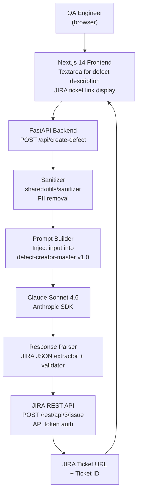

# ARCHITECTURE — PoC 02: JIRA Defect Creator

---

## Component Diagram



> **TODO (Gopi):** Refine on Day 5 once JIRA auth method is confirmed.

---

## Components

| Component | File (planned) | Responsibility |
|-----------|---------------|----------------|
| FastAPI app | `backend/main.py` | Route definitions, CORS config |
| Defect endpoint | `backend/routers/defect.py` | `POST /api/create-defect` handler |
| Sanitizer | `shared/utils/sanitizer.py` | PII scrub |
| Prompt builder | `backend/services/prompt_builder.py` | Constructs full prompt |
| Claude client | `backend/services/claude_client.py` | Anthropic SDK wrapper |
| Response parser | `backend/services/response_parser.py` | Validates JIRA JSON schema |
| JIRA client | `backend/services/jira_client.py` | JIRA REST API calls (httpx) |
| Config | `backend/config.py` | Env vars incl. JIRA credentials |

---

## Data Flow

1. User pastes freetext defect description into frontend
2. Frontend `POST /api/create-defect` with `{description, environment, context}`
3. Backend sanitizes input
4. Prompt builder constructs full prompt using defect-creator-master v1.0
5. Claude Sonnet 4.6 returns structured JIRA JSON
6. Response parser validates required fields; flags `NEEDS REVIEW` items
7. JIRA client creates ticket via REST API using API token auth
8. Backend returns ticket URL + ID to frontend

---

## JIRA Integration Notes

> **TODO (Gopi):** Before Day 5:
> - Create Atlassian free-tier account with a sandbox Jira project
> - Generate an API token from https://id.atlassian.com/manage-profile/security/api-tokens
> - Confirm field mapping between Claude JSON output and JIRA issue fields (may vary by project config)

---

## Error Handling

| Error | Handling |
|-------|---------|
| JIRA API 401 Unauthorized | Return 401 with "check JIRA_API_TOKEN env var" |
| JIRA API 400 field validation | Log JIRA error detail; return to user for manual fix |
| Claude malformed JSON | Return raw Claude response as fallback for manual ticket creation |
| PII detected | Reject with 400; sanitization warning |

---

## Configuration

```
ANTHROPIC_API_KEY=sk-ant-...
CLAUDE_MODEL=claude-sonnet-4-6
JIRA_BASE_URL=https://your-sandbox.atlassian.net
JIRA_EMAIL=your_email@example.com
JIRA_API_TOKEN=your_jira_api_token
JIRA_PROJECT_KEY=QA
```
