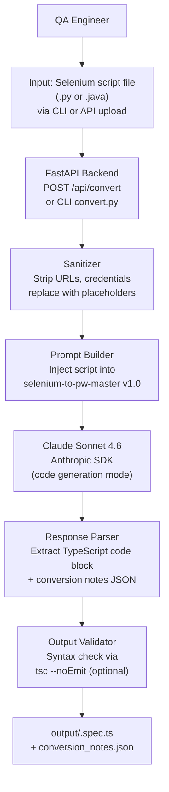

# ARCHITECTURE — PoC 03: Selenium → Playwright Converter

---

## Component Diagram



> **TODO (Gopi):** Decide CLI vs. API approach on Day 7 morning — CLI may be simpler for PoC demo.

---

## Components

| Component | File (planned) | Responsibility |
|-----------|---------------|----------------|
| FastAPI app or CLI | `backend/main.py` or `convert.py` | Entry point |
| Convert endpoint | `backend/routers/convert.py` | `POST /api/convert` handler |
| Sanitizer | `backend/services/sanitizer.py` | Strip URLs/credentials from scripts |
| Prompt builder | `backend/services/prompt_builder.py` | Build conversion prompt |
| Claude client | `backend/services/claude_client.py` | Anthropic SDK wrapper |
| Response parser | `backend/services/response_parser.py` | Extract `.ts` code + notes from response |
| Output writer | `backend/services/output_writer.py` | Write `.spec.ts` and `_notes.json` to `output/` |

---

## Data Flow

1. QA engineer provides Selenium script file
2. Sanitizer strips real URLs, credentials, replaces with `[PLACEHOLDER]`
3. Prompt builder constructs full conversion prompt
4. Claude Sonnet 4.6 returns converted TypeScript + conversion notes
5. Parser extracts the TypeScript code block
6. Output writer saves `<name>.spec.ts` to `output/`
7. Optional: run `npx tsc --noEmit` to check syntax

---

## Scope for PoC

- **In scope:** Python Selenium scripts with basic interactions (navigate, click, fill, assert)
- **Out of scope for PoC:** Java Selenium, complex iFrame handling, file uploads, network interception, multi-browser config
- All out-of-scope patterns flagged in `conversion_notes.manual_review_required`

---

## Error Handling

| Error | Handling |
|-------|---------|
| Claude returns non-parseable TypeScript | Return raw output with `MANUAL_REVIEW_REQUIRED` flag |
| Input script unparseable | Return 400 with Claude's error detail |
| TypeScript syntax error in output | Log error; flag in conversion notes; do not fail silently |

---

## Configuration

```
ANTHROPIC_API_KEY=sk-ant-...
CLAUDE_MODEL=claude-sonnet-4-6
INPUT_DIR=./input
OUTPUT_DIR=./output
```
