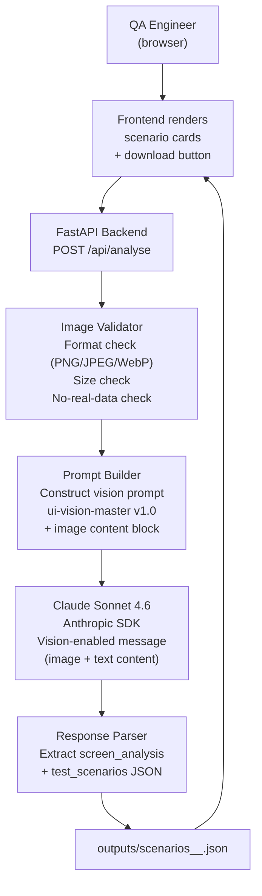

# ARCHITECTURE — PoC 04: UI Vision

---

## Component Diagram



> **TODO (Gopi):** Refine on Day 8.

---

## Components

| Component | File (planned) | Responsibility |
|-----------|---------------|----------------|
| FastAPI app | `backend/main.py` | Route definitions, CORS, file upload handling |
| Analyse endpoint | `backend/routers/analyse.py` | `POST /api/analyse` — multipart form (image + metadata) |
| Image validator | `backend/services/image_validator.py` | Format, size, basic content checks |
| Prompt builder | `backend/services/prompt_builder.py` | Construct vision prompt with image content block |
| Claude client | `backend/services/claude_client.py` | Anthropic SDK — sends `image` content type |
| Response parser | `backend/services/response_parser.py` | Extract and validate scenario JSON |
| Output writer | `backend/services/output_writer.py` | Save JSON to `outputs/` |

---

## Vision API Integration Notes

Claude Sonnet 4.6 accepts images via the Messages API `content` array:

```python
# Pseudocode — DO NOT implement yet
message = client.messages.create(
    model="claude-sonnet-4-6",
    messages=[{
        "role": "user",
        "content": [
            {"type": "image", "source": {"type": "base64", "media_type": "image/png", "data": "<base64>"}},
            {"type": "text", "text": "<prompt from ui-vision-master>"}
        ]
    }]
)
```

> **TODO (Gopi):** Verify current image size limits and supported formats in Anthropic docs before Day 8 implementation.

---

## Data Flow

1. User uploads synthetic banking UI screenshot via frontend
2. Image validator checks format/size; rejects if invalid
3. Prompt builder encodes image as base64 + constructs vision prompt
4. Claude Sonnet 4.6 analyses image and returns structured JSON
5. Parser validates JSON schema
6. Output writer saves to `outputs/`
7. Frontend renders scenario cards and download link

---

## Error Handling

| Error | Handling |
|-------|---------|
| Unsupported image format | Return 400 with supported format list |
| Image too large | Return 400 with size limit guidance |
| Claude cannot identify UI elements | Return partial output with `low_confidence` flag in notes |
| Malformed JSON response | Return raw response with `MANUAL_REVIEW_REQUIRED` flag |

---

## Configuration

```
ANTHROPIC_API_KEY=sk-ant-...
CLAUDE_MODEL=claude-sonnet-4-6
OUTPUT_DIR=./outputs
MAX_IMAGE_SIZE_MB=5
```
